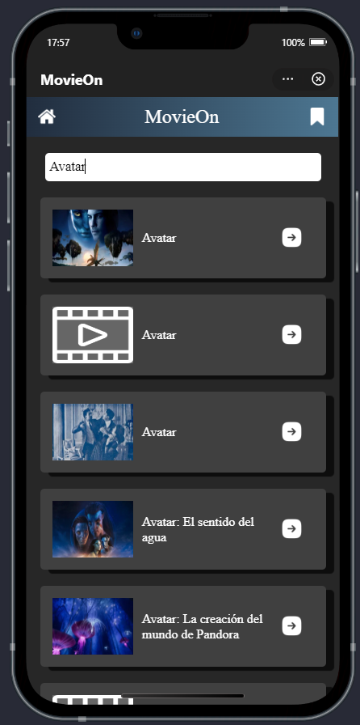
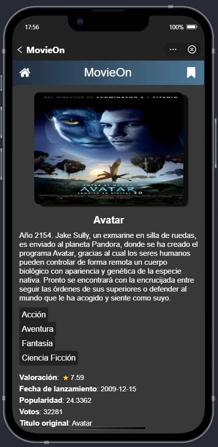
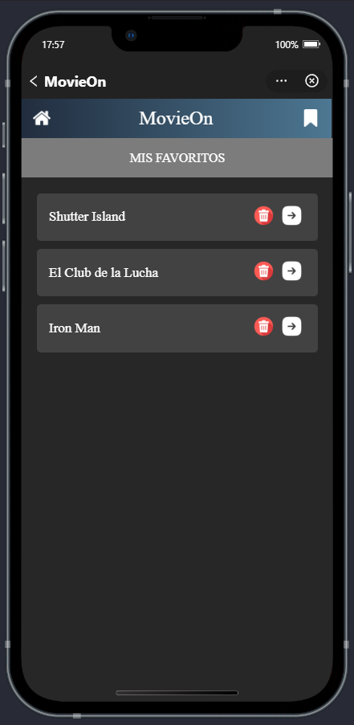

# MovieOn 🎬

**MovieOn** es una aplicación móvil diseñada para buscar, crear y administrar una lista de películas favoritas utilizando la API de **TMDb** (The Movie Database). Desarrollada con **Mini Program Studio**, esta aplicación ofrece una experiencia intuitiva y eficiente para los amantes del cine.

---

## Características principales ✨

- **Búsqueda de películas**: Busca películas por título, género o año de lanzamiento utilizando la API de TMDb.
- **Lista de favoritos**: Guarda tus películas favoritas en una lista personalizada.
- **Detalles de películas**: Visualiza información detallada de cada película, como sinopsis, elenco, calificación y tráiler.
- **Interfaz intuitiva**: Diseño moderno y fácil de usar, optimizado para dispositivos móviles.
- **Almacenamiento local**: Guarda tu lista de favoritos localmente para acceder a ella sin conexión.

---

## Tecnologías utilizadas 🛠️

- **Mini Program Studio**: Entorno de desarrollo para crear mini programas en plataformas como WeChat.
- **API de TMDb**: Base de datos de películas y series para obtener información actualizada.
- **AXML y ACSS**: Lenguajes de marcado y estilos para la interfaz de usuario.
- **JavaScript**: Lógica de la aplicación y manejo de datos.
- **Almacenamiento local**: Uso de `my.setStorageSync` y `my.getStorageSync` para guardar datos localmente.

---

## Capturas de pantalla 📸

| Búsqueda de películas       | Detalles de película        | Lista de favoritos         |
|-----------------------------|-----------------------------|----------------------------|
|  |  |  |

---

## Cómo usar 🚀

1. **Clona el repositorio**:
   ```
   git clone https://github.com/Kharlz01/MovieOn.git
   ```

2. **Abre el proyecto en Mini Program Studio:**

  - Abre Mini Program Studio y selecciona "Abrir proyecto".

  - Navega hasta la carpeta del proyecto y selecciónala.

3. **Configura la API de TMDb:**

  - Obtén una API key de TMDb.

  - Reemplaza la clave en el archivo de configuración (config.js):

```
const API_KEY = 'tu_api_key_aquí';
```

4. **Ejecuta el proyecto:**

  - Compila y ejecuta el proyecto en Mini Program Studio.

  - Escanea el código QR con la app de WeChat para probarlo en tu dispositivo móvil.

## Estructura del proyecto 📂

```
movieon/
├── pages/
│   ├── index/          # Página principal (búsqueda)
│   ├── details/        # Página de detalles de película
│   ├── bookmarks/      # Página de lista de favoritos
├── components/         # Componentes reutilizables
├── utils/              # Utilidades y funciones comunes
├── images/             # Iconos utilizados por la aplicación
├── out/                # Directorio de la documentación con Jsdoc
├── test/               # Directorio de las pruebas unitarias (jest)
├── app.js              # Configuración global
├── app.json            # Configuración de la aplicación
├── app.acss            # Estilos globales
└── README.md           # Documentación base del proyecto
```

## Contribuir 🤝

¡Las contribuciones son bienvenidas! Si deseas mejorar el proyecto, sigue estos pasos:

1. Haz un fork del repositorio.

2. Crea una rama para tu feature o corrección:
```
git checkout -b nombre-de-tu-rama
```
3. Realiza tus cambios y haz commit:
```
git commit -m "Descripción de tus cambios"
```
4. Envía un pull request a la rama main.

## Licencia 📜

Este proyecto está bajo la licencia MIT.

¡Gracias por usar MovieOn! 🎥🍿